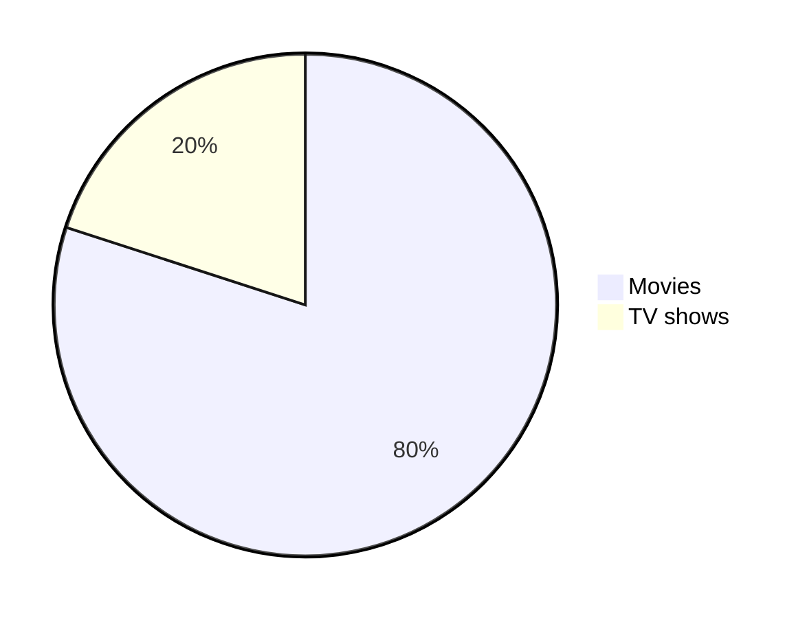

> This cheat sheet bases on internet researches and dedicated pages with good examples, on site to mention is:
> https://towardsdatascience.com/the-ultimate-markdown-cheat-sheet-3d3976b31a0
> 

# Heading 1
## Heading 2
### Heading 3
#### Heading 4
##### Heading 5

---
## Table of Contents
- [Heading 1](#heading-1)
  - [Heading 2](#heading-2)
    - [Heading 3](#heading-3)
      - [Heading 4](#heading-4)
        - [Heading 5](#heading-5)
  - [Table of Contents](#table-of-contents)
  - [Text formating](#text-formating)
    - [Bold](#bold)
    - [Italic](#italic)
    - [Bold and Italic](#bold-and-italic)
    - [Strikethrough](#strikethrough)
    - [Monospaced](#monospaced)
    - [Underlined](#underlined)
    - [Boxed](#boxed)
    - [Subscript and superscripted](#subscript-and-superscripted)
    - [Others](#others)
  - [Syntax Highlighting](#syntax-highlighting)
    - [Block Syntax Highlighting](#block-syntax-highlighting)
  - [Blockquotes](#blockquotes)
  - [Alignments](#alignments)
    - [Text Alignment](#text-alignment)
  - [Tables](#tables)
  - [Links](#links)
  - [Images](#images)
    - [HTML Style](#html-style)
    - [Using GIFs](#using-gifs)
  - [Lists](#lists)
    - [Sub Lists](#sub-lists)
    - [Unordered Lists](#unordered-lists)
    - [Selection lists](#selection-lists)
  - [Buttons](#buttons)
  - [Horizontal Rulers](#horizontal-rulers)
  - [Diagrams using Mermaid](#diagrams-using-mermaid)
    - [Pie Chart](#pie-chart)
  - [Mathematical expressions (not working with VSCode PDF converter)](#mathematical-expressions-not-working-with-vscode-pdf-converter)
  - [Special characters used in AZURE DevOps / GitHub](#special-characters-used-in-azure-devops--github)

---
## Text formating
### Bold
**The quick brown fox jumps over the lazy dog.**
__The quick brown fox jumps over the lazy dog.__
<strong>The quick brown fox jumps over the lazy dog.</strong>

### Italic
*The quick brown fox jumps over the lazy dog.*
_The quick brown fox jumps over the lazy dog._
<em>The quick brown fox jumps over the lazy dog.</em>

### Bold and Italic
**_The quick brown fox jumps over the lazy dog._**
<strong><em>The quick brown fox jumps over the lazy dog.</em></strong>

### Strikethrough
Strikethrough uses two tildes. ~~Scratch this.~~

### Monospaced
<samp>The quick brown fox jumps over the lazy dog.</samp>

### Underlined
<ins>The quick brown fox jumps over the lazy dog.</ins>

### Boxed
<table><tr><td>The quick brown fox jumps over the lazy dog.</td></tr></table>

### Subscript and superscripted
2 <sup>53-1</sup> and -2 <sup>53-1</sup>

Subscript <sub>The quick brown fox jumps over the lazy dog.</sub>
Superscript <sup>The quick brown fox jumps over the lazy dog.</sup>

### Others
<font color="red">Dieser text ist rot</font>

<span style="background-color: #FFFF00">dieser Text ist gehighlighted.</span>


---

## Syntax Highlighting
A class method is an instance method of the class object. When a new class is created, an object of type `Class` is initialized and assigned to a global constant (Mobile in this case).

### Block Syntax Highlighting

```java
public static String monthNames[] = {"January", "February", "March", "April", "May", "June", "July", "August", "September", "October", "November", "December"};
```

---
## Blockquotes
> The quick brown fox jumps over the lazy dog.

> The quick brown fox jumps over the lazy dog.
> 
> The quick brown fox jumps over the lazy dog.
> 
> The quick brown fox jumps over the lazy dog.

> The quick brown fox jumps over the lazy dog.
>> The quick brown fox jumps over the lazy dog.
>>> The quick brown fox jumps over the lazy dog.

> **The quick brown fox** *jumps over the lazy dog.*

---
## Alignments

<p align="left">
left

</p>

<p align="center">
center

</p>

<p align="right">
right

</p>

### Text Alignment
<h4 align="center"> My latest Medium posts </h4>

## Tables
Markdown | Less | Pretty
--- | --- | ---
*Still* | `renders` | **nicely**
1 | 2 | 3

<table>
<tr>
<th>Heading 1</th>
<th>Heading 2</th>
</tr>
<tr>

<td>

| A | B | C |
|--|--|--|
| 1 | 2 | 3 |

</td><td>

| A | B | C |
|--|--|--|
| 1 | 2 | 3 |

</td></tr> </table>

## Links

[The-Ultimate-Markdown-Cheat-Sheet](https://github.com/lifeparticle/Markdown-Cheatsheet)

> Using internal references within the document.

[1]: http://jamesqquick.com/ 

[Link to a test site.][1] 

## Images


> Using internal references within the document.

![alt text][image]

[image]: https://images.unsplash.com/photo-1415604934674-561df9abf539?ixlib=rb-1.2.1&ixid=eyJhcHBfaWQiOjEyMDd9&auto=format&fit=crop&w=100&q=80

### HTML Style


### Using GIFs


---
## Lists
1. One
2. Two
3. Three

### Sub Lists
1. First level
    1. Second level
        - Third level
            - Fourth level
2. First level
    1. Second level
3. First level
    1. Second level

### Unordered Lists
* 1
* 2
* 3

+ 1
+ 2
+ 3

- 1
- 2
- 3

- First level
    - Second level
        - Third level
            - Fourth level
- First level
    - Second level
- First level
    - Second level

### Selection lists
This is a selection list
- [X] List
- [ ] Test
- [ ] Test2

---
## Buttons
We can add buttons to describe keyboard shortcuts.

<kbd>cmd + shift + p</kbd>

<kbd>[Markdown-Cheatsheet](https://github.com/lifeparticle/Markdown-Cheatsheet)</kbd>

## Horizontal Rulers
---
***
___

## Diagrams using Mermaid
### Pie Chart
>See mermaid cheat sheet



---

## Mathematical expressions (not working with VSCode PDF converter)
You can now include diagrams using mathjax. You can read more on GitHub. We can use $ symbol to show inline and $$ symbols to show math expressions as a block. Here is an example of an inline math expression:

This is an inline math expression $x = {-b \pm \sqrt{b^2-4ac} \over 2a}$

$$
x = {-b \pm \sqrt{b^2-4ac} \over 2a}
$$

---

## Special characters used in AZURE DevOps / GitHub
\# - to mention a dedicated workitem or github change

\@ - to mention a name or contact
