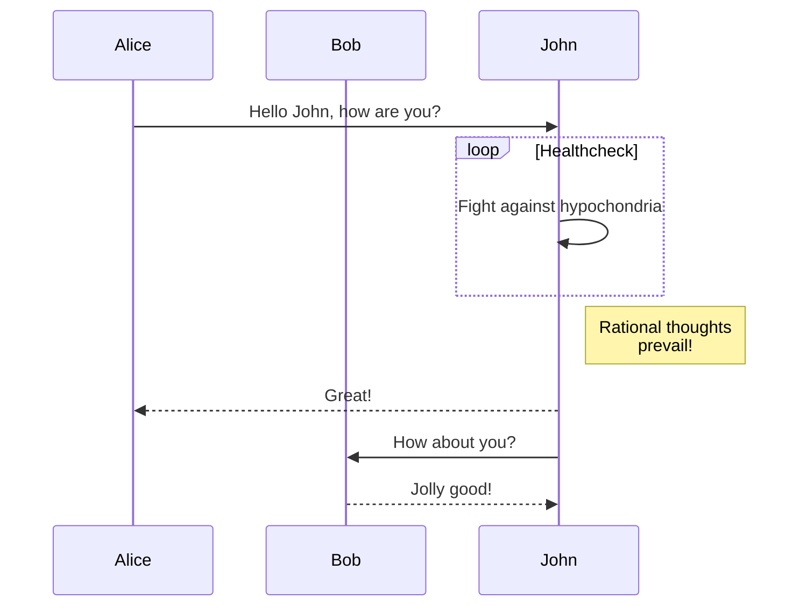
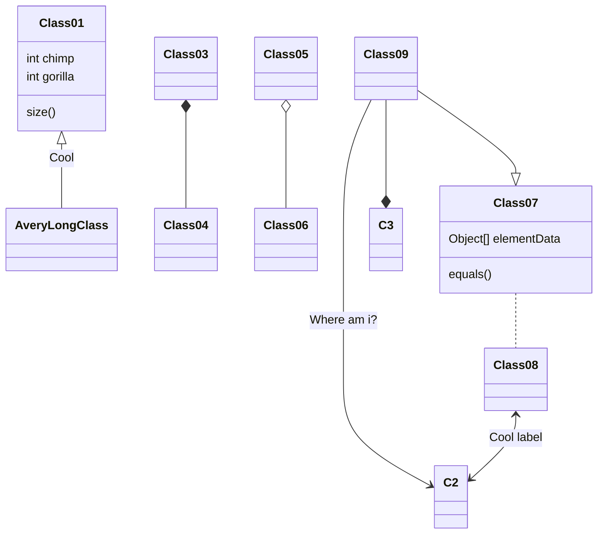
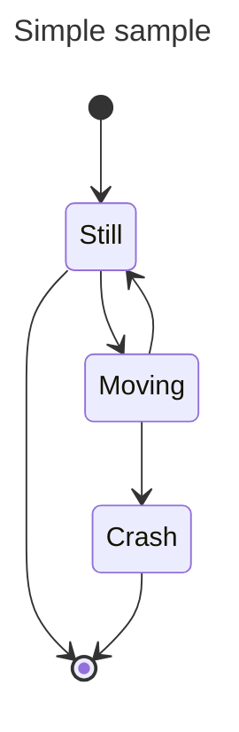

# Markdown Mermaid Cheat Sheet
This cheat sheet gives an overview on the most popular diagrams in markdown - mermaid. An overview can be found at: [mermaid](https://mermaid.js.org/intro/)

## Table of Content
- [Markdown Mermaid Cheat Sheet](#markdown-mermaid-cheat-sheet)
  - [Table of Content](#table-of-content)
  - [Flow chart](#flow-chart)
  - [Sequence Diagram](#sequence-diagram)
  - [Class Diagram](#class-diagram)
  - [State diagram](#state-diagram)

## Flow chart
> Find more details on:
> [Mermaid FlowCharts](https://mermaid.js.org/syntax/flowchart.html)

## Sequence Diagram
> Find more details on:
> [Mermaid Sequence Diagrams](https://mermaid.js.org/syntax/sequenceDiagram.html)

## Class Diagram
>Find more details on:
[Mermaid Class Diagrams](https://mermaid.js.org/syntax/classDiagram.html)

## State diagram
>Find more details on:
>[Mermaid State Diagram](https://mermaid.js.org/syntax/stateDiagram.html)
